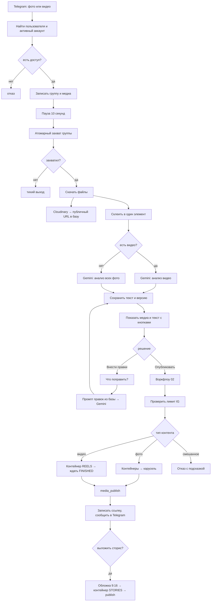

# SMM-бот для мебельной мастерской

Telegram-бот на n8n: вы присылаете фотографии или видео готовой работы, бот
изучает их, пишет пост для Instagram, показывает вам на утверждение и после
вашего «да» публикует. Потом предлагает выложить сторис с анонсом.

```text
фото или видео в Telegram → анализ и текст → вы одобряете или правите
→ Instagram → предложить сторис
```

## Что умеет

- **Альбомы.** Всё, что отправлено в течение 10 секунд, собирается в один пост.
  Модель видит объект с разных ракурсов, а не пять раз по одной картинке.
- **Видео и Reels.** Видео до 20 МБ модель смотрит целиком и пишет текст по
  тому, что происходит в кадре, а публикуется оно как Reels.
- **Несколько аккаунтов Instagram.** У одного человека может быть сколько
  угодно аккаунтов со своим брендом, тоном, хештегами и токеном. Переключение
  командой `/use кухни`.
- **Промпты в базе.** Инструкции для модели лежат в таблице, а не в нодах.
  Можно менять текст промпта на ходу и задать отдельный промпт конкретному
  аккаунту — воркфлоу трогать не нужно.
- **Два режима текста.** Фото работы превращается в пост-кейс, а рекламный
  макет — в рекламный пост. Режим определяется по подписи и по картинке.
- **Ваш текст важнее.** Всё, что вы напишете в подписи (материалы, сроки, цена,
  условия акции), попадёт в пост дословно.
- **Правки в диалоге.** Не понравилось — пишете что поправить, бот переписывает
  и снова показывает. История версий сохраняется.
- **Сторис одной кнопкой.** После публикации бот спрашивает, выложить ли сторис.
  Обложка 1080×1920 с надписями собирается автоматически из первого кадра.
- **Карусель.** Несколько фото публикуются одним постом-каруселью.
- **Защита от дублей.** Один и тот же кадр не попадёт в пост дважды, а
  случайное двойное нажатие кнопки не опубликует пост дважды.
- **Отложенная публикация.** Одобрили ночью — ушло утром.
- **Уведомления об ошибках.** Падения приходят в Telegram, а не остаются в
  логах, куда никто не смотрит.

## Что внутри

| Файл | Что там |
|------|---------|
| `docker-compose.yml` | n8n + PostgreSQL + туннель Cloudflare |
| `Dockerfile` | образ n8n |
| `sql/001_schema.sql` | базовые таблицы, индексы, триггеры |
| `sql/002_seed.sql` | первый пользователь |
| `sql/003_accounts_prompts_media.sql` | аккаунты, промпты в базе, видео, сторис |
| `sql/004_example_second_account.sql` | образец: второй аккаунт со своим промптом |
| `sql/queries.sql` | все SQL-запросы для нод, пронумерованы |
| `n8n/01-draft.json` | воркфлоу: приём медиа и согласование |
| `n8n/02-publish.json` | воркфлоу: публикация поста, Reels и сторис |
| `n8n/03-schedule.json` | воркфлоу: расписание и уборка |
| `n8n/04-errors.json` | воркфлоу: уведомления об ошибках |
| `docs/nodes.md` | что вписано в каждую ноду и почему |
| `docs/prompts.md` | промпты для модели |
| `docs/README-v1.md` | инструкция к первой версии (архив) |
| `workflows/` | первая версия: один воркфлоу, сбор альбома паузой |
| `.env.example` | список всех ключей и токенов |

## Про две версии в одном репозитории

В `workflows/` лежит первая реализация — один воркфлоу, который собирал альбом
паузой в 7 секунд и публиковал только фото. Она работает и остаётся на месте,
инструкция к ней — `docs/README-v1.md`.

Всё остальное — вторая версия. Она появилась из-за одной конкретной проблемы:
пауза внутри воркфлоу не спасает от того, что Telegram присылает альбом пятью
отдельными сообщениями и n8n запускает пять параллельных выполнений. Разбор
этой проблемы — следующий раздел.

Инфраструктура общая: `docker-compose.yml`, `Dockerfile` и `.env` одни и те же
для обеих версий.

---

# Как это работает

Разберём по-честному, потому что без понимания устройства чинить будет тяжело.

## Проблема, вокруг которой всё построено

Когда вы отправляете альбом из пяти фотографий, Telegram шлёт **пять отдельных
сообщений**, связанных только общим номером `media_group_id`. Для n8n это пять
независимых запусков воркфлоу. Каждый видит своё фото и ничего не знает о
соседях.

Наивные решения не работают:

- Собрать через ноду Aggregate нельзя — внутри одного запуска всего один
  элемент, агрегировать нечего.
- Накопить в памяти воркфлоу (static data) нельзя — n8n читает её при старте
  выполнения и записывает при завершении. Пять параллельных запусков прочитают
  пустоту, каждый допишет своё, и последний затрёт остальных.

## Решение: база данных как арбитр

Все пять запусков пишут свои фото в Postgres. Ограничение `unique` не даёт
создать группу дважды, а конкурентные вставки база разруливает сама — это её
прямая работа.

Дальше все пятеро ждут 10 секунд и одновременно выполняют один запрос:

```sql
update post_groups set status = 'generating'
where group_key = $1 and status = 'collecting'
returning *;
```

Postgres обрабатывает такие запросы строго по очереди. Первый переведёт статус
и получит строку в ответ. Остальные четыре придут, когда статус уже не
`collecting`, и получат **ноль строк**.

А в n8n есть простое правило: **если нода вернула ноль элементов, все ноды ниже
не выполняются**. Четыре лишних запуска останавливаются сами собой, без единой
строки кода и без всяких проверок «кто здесь главный».

Пятый идёт дальше и делает один запрос к модели со всеми пятью картинками.

## Аккаунты и промпты живут в базе

Раньше настройки бренда лежали в `users`. Это работало, пока у человека один
Instagram. Теперь «кто пишет боту» и «куда публикуем» — разные сущности:

```text
users ──┬── accounts ──┬── prompt_templates (свой промпт аккаунта)
        │              └── post_groups → post_media
        └── active_account_id (что выбрано прямо сейчас)
```

Промпт не собирается в ноде. Он лежит в `prompt_templates.body` с дырками вида
`{{brand_name}}` и `{{caption}}`, а SQL-функция `render_prompt` подставляет
значения и отдаёт готовый текст. Нода Gemini получает просто `{{ $json.prompt }}`
и ничего не знает ни про бренды, ни про режимы.

Выбор шаблона такой: сначала ищется шаблон конкретного аккаунта, если его нет —
берётся общий (`account_id is null`). Поэтому можно завести один аккаунт с очень
узким промптом про кухни, а остальные оставить на общем.

Практический смысл: чтобы поменять стиль текстов, вы делаете `update` в базе.
Не открываете n8n, не рискуете сломать воркфлоу, не теряете историю.

## Сторис: что можно и что нельзя

**Кликабельную ссылку на пост в сторис через API добавить нельзя.** Meta прямо
пишет в документации: публикация стикеров (link, poll, location) не
поддерживается. Никакого обходного пути нет — сторонние сервисы, которые это
умеют, имеют особый партнёрский доступ.

Поэтому кнопка сторис делает то, что реально работает:

1. берёт первый кадр поста (для видео — кадр на первой секунде);
2. обрезает его в 1080×1920 и накладывает две надписи и ваш `@юзернейм` —
   всё это одной ссылкой-трансформацией Cloudinary, без обработки картинок на
   вашем сервере;
3. публикует как сторис.

Зритель видит анонс и уходит в профиль, где пост лежит сверху. Это ровно то,
что делают руками, когда «выкладывают сторис со ссылкой на новый пост».

Текст надписей настраивается на аккаунт: поля `story_headline` и
`story_subline` в таблице `accounts`.

## Полная схема



Промпт для Gemini на схеме не показан отдельным шагом: он приезжает готовым
из ноды «Медиа и настройки» вместе с остальными данными.

## Сколько тут кода

Две ноды на весь проект.

«Склеить медиа» в воркфлоу 01 — потому что Gemini принимает несколько файлов
исключительно внутри одного элемента данных, а у нас их пять в пяти разных.

«Собрать сторис» в воркфлоу 02 — собирает адрес трансформации Cloudinary.
Технически это можно уложить в одно выражение, но получилась бы строка на
пол-экрана, которую невозможно читать и править.

Всё остальное — настройки нод, SQL-запросы и короткие выражения в полях.

---

# Установка

## Что нужно иметь

- Docker с плагином Compose
- Telegram-бот
- Ключ Google Gemini
- Аккаунт Cloudinary
- Instagram Business или Creator, привязанный к странице Facebook
- Приложение Meta с правом публиковать

n8n, PostgreSQL и публичный HTTPS-адрес поднимает `docker-compose.yml`, отдельно
их ставить не нужно. Первые четыре пункта делаются за полчаса. Последние два —
самая долгая часть, и она никак не связана с n8n.

## Шаг 0. Поднять n8n

```bash
cp .env.example .env
# заполните пароли и токены, затем:
docker compose up -d --build
```

Редактор n8n откроется на `http://localhost:5678`, логин и пароль — из
`N8N_BASIC_AUTH_*`.

Публичный адрес для вебхуков Telegram даёт быстрый туннель Cloudflare. Наш
`docker-compose.yml` забирает его автоматически: перед стартом n8n опрашивает
`/quicktunnel` у контейнера `cloudflared` и подставляет адрес в `WEBHOOK_URL`.
Проверить, какой адрес выдан:

```bash
docker compose logs n8n | grep "адрес туннеля"
```

Адрес быстрого туннеля **меняется при каждом перезапуске**. После рестарта
выключите и снова включите Active у воркфлоу 01, иначе Telegram продолжит
стучаться на старый адрес. Если нужен постоянный адрес, в `docker-compose.yml`
описан режим 2 — именованный туннель со своим доменом.

Подробнее про запуск, туннель и полезные команды Docker — в `docs/README-v1.md`,
эта часть одинакова для обеих версий.

## Шаг 1. Создать таблицы

Порт PostgreSQL наружу не опубликован, поэтому `psql` с хоста до него не
достучится. Все команды идут через контейнер.

Сначала отдельная база под таблицы бота. Служебные таблицы n8n живут в базе
`n8n`, и смешивать с ними свои данные не стоит: миграции n8n при обновлении
версии трогают свою базу, и лишние таблицы там ни к чему.

```bash
docker compose exec -T postgres createdb -U n8n smmbot
```

Дальше схема и миграции. Порядок важен: 003 дополняет и переносит то, что
создали 001 и 002.

```bash
docker compose exec -T postgres psql -U n8n -d smmbot < sql/001_schema.sql
# впишите свой Telegram Id в 002_seed.sql перед этим шагом
docker compose exec -T postgres psql -U n8n -d smmbot < sql/002_seed.sql
docker compose exec -T postgres psql -U n8n -d smmbot < sql/003_accounts_prompts_media.sql
```

Здесь `n8n` — это значение `POSTGRES_USER`, а `smmbot` — `SMMBOT_DB` из `.env`.
Если меняли их, подставьте свои.

Третий файл переименует `post_photos` в `post_media`, создаст таблицы
`accounts` и `prompt_templates` и сам перенесёт настройки бренда из `users` в
первый аккаунт с ключом `main`. Он идемпотентный — повторный запуск ничего не
испортит.

Проверьте:

```bash
docker compose exec -T postgres psql -U n8n -d smmbot -c "\dt"
docker compose exec -T postgres psql -U n8n -d smmbot -c "select keyword, title, brand_name from accounts;"
docker compose exec -T postgres psql -U n8n -d smmbot -c "select kind, length(body) from prompt_templates where is_active;"
```

Должны быть таблицы `users`, `accounts`, `prompt_templates`, `post_groups`,
`post_media`, `post_revisions`, `publish_log`, один аккаунт и три шаблона
промптов.

## Шаг 2. Получить ключи

### Telegram-бот

1. Напишите [@BotFather](https://t.me/BotFather), команда `/newbot`.
2. Сохраните токен.
3. Напишите [@userinfobot](https://t.me/userinfobot) — он пришлёт ваш числовой
   Id. Он понадобится дважды: в базе и при проверках.

### Google Gemini

1. Зайдите в [Google AI Studio](https://aistudio.google.com/), получите API key.
2. Проверьте, какие модели доступны вашему ключу:

```bash
curl "https://generativelanguage.googleapis.com/v1beta/models?key=ВАШ_КЛЮЧ"
```

Нам нужна `models/gemini-2.5-flash`.

### Cloudinary

Instagram не принимает файлы напрямую — только публичную HTTPS-ссылку, которую
он скачает сам. Cloudinary выбран потому, что закрывает сразу три задачи:
хранит и видео, и картинки, отдаёт постоянные ссылки и умеет обрезать кадр под
сторис прямо в адресе файла.

1. Зарегистрируйтесь на [cloudinary.com](https://cloudinary.com/).
2. На дашборде найдите **Cloud name** — понадобится в URL ноды.
3. Settings → Upload → Add upload preset → **Signing Mode: Unsigned**.
   Сохраните имя пресета.

Unsigned-пресет нужен, чтобы не считать подпись запроса кодом внутри n8n:
загрузка становится обычным POST с двумя полями.

Бесплатный тариф — 25 кредитов в месяц, примерно 25 ГБ трафика. Для нескольких
постов в день это с большим запасом.

### Instagram

Порядок такой:

1. Переключите Instagram в режим Professional (Business или Creator).
2. Привяжите его к странице Facebook.
3. На [developers.facebook.com](https://developers.facebook.com/) создайте
   приложение, добавьте Instagram API.
4. Получите права `instagram_basic`, `instagram_content_publish`,
   `pages_show_list`, `pages_read_engagement`.
5. Возьмите долгоживущий Page Access Token и узнайте `IG_USER_ID`.

**Проверьте доступ вручную до того, как трогать n8n.** Если этот запрос не
работает, воркфлоу тем более не заработает:

```bash
curl "https://graph.facebook.com/v21.0/IG_USER_ID/content_publishing_limit?fields=quota_usage,config&access_token=ТОКЕН"
```

Ожидаемый ответ содержит `quota_total: 50`.

## Шаг 3. Завести креденшелы в n8n

Три штуки, в разделе Credentials:

| Тип | Что вписать |
|-----|-------------|
| Telegram API | токен бота |
| Postgres | Host `postgres`, Port `5432`, Database `smmbot`, User и Password из `.env` |
| Google Gemini(PaLM) Api | Host: `https://generativelanguage.googleapis.com`, API Key: ваш ключ |

Хост базы — именно `postgres`, а не `localhost`: n8n обращается к ней по имени
сервиса внутри сети Docker.

**Про Host отдельно.** В нём должен быть только базовый адрес. Без `/v1beta`,
без `/models`, без имени модели. Нода дописывает путь сама, и лишний хвост
даёт ошибку 404 — это самая частая проблема с этой нодой.

## Шаг 4. Импортировать воркфлоу

В n8n: меню → Import from File. Импортируйте по очереди все четыре файла из
папки `n8n/`.

**Порядок важен**: сначала `02-publish.json`, потому что на него ссылаются
остальные.

## Шаг 5. Заполнить заглушки

В импортированных воркфлоу есть места, помеченные заглушками. Найдите и
замените:

| Где | Заглушка | На что |
|-----|----------|--------|
| 01, нода «Залить на Cloudinary» | `ВСТАВЬТЕ_CLOUD_NAME` в URL | Cloud name |
| 01, нода «Залить на Cloudinary» | `ВСТАВЬТЕ_UPLOAD_PRESET` | имя unsigned-пресета |
| 01, нода «Отправить альбом» | `ВСТАВЬТЕ_ТОКЕН_БОТА` в URL | токен бота |
| 01, нода «Опубликовать» | `ВСТАВЬТЕ_ID_ВОРКФЛОУ_02` | id воркфлоу 02 |
| 03, нода «Опубликовать отложенное» | `ВСТАВЬТЕ_ID_ВОРКФЛОУ_02` | id воркфлоу 02 |

Id воркфлоу виден в адресной строке, когда он открыт: `.../workflow/ЭТО_ID`.

Дальше в каждой ноде Telegram, Postgres и Gemini выберите созданные
креденшелы — при импорте они не переносятся.

В настройках воркфлоу 01, 02 и 03 (Settings → Error Workflow) выберите
«04 Ошибки».

## Шаг 6. Дописать данные аккаунта

Пользователь и первый аккаунт появились на шаге 1. Осталось вписать в аккаунт
то, что вы получили от Meta и Instagram:

```sql
update accounts
set ig_user_id      = '17841400000000000',
    ig_access_token = 'EAAG...',
    ig_username     = 'вашюзернейм',        -- без @, попадёт на обложку сторис
    story_headline  = 'НОВЫЙ ПРОЕКТ',
    story_subline   = 'замер бесплатно — пишите в Direct'
where keyword = 'main';
```

Второй аккаунт добавляется по образцу из `sql/004_example_second_account.sql` —
там же показано, как дать ему собственный промпт.

## Шаг 7. Проверить по частям

Не включайте всё сразу. Порядок, который экономит вечер:

1. **Доступ.** Активируйте воркфлоу 01, напишите боту `/help`. Должна прийти
   справка. Если тишина — проблема в вебхуке или в креденшелах Telegram.
2. **База.** Отправьте одно фото. Через 10–15 секунд проверьте:

```sql
select * from v_post_overview limit 5;
```

Должна появиться строка со статусом и количеством фотографий.

3. **Модель.** Если строка есть, но текст не пришёл, откройте Executions и
   посмотрите ноду «Описать фото».
4. **Альбом.** Отправьте 5 фотографий разом. В Executions будет 5 записей:
   одна полная и четыре коротких, оборвавшихся на «Захватить группу». Это
   правильное поведение, а не ошибка.
5. **Видео.** Отправьте короткий ролик до 20 МБ. В базе `media_kind` должен
   стать `video`, а текст — говорить о том, что происходит в кадре.
6. **Публикация.** Только теперь нажмите «Опубликовать».
7. **Сторис.** После успешной публикации придёт вопрос про сторис. Прежде чем
   согласиться, откройте ссылку на обложку из сообщения бота и посмотрите, как
   легли надписи — их положение правится в ноде «Собрать сторис».

**Важно:** тестируйте отправкой боту, а не кнопкой Execute Workflow. Ручной
запуск не воспроизводит параллельные выполнения, из-за которых вся эта
конструкция и построена.

---

# Как пользоваться

**Обычный пост.** Отправьте фото работы, можно альбомом. В подписи к первому
файлу укажите факты, которые должны попасть в текст:

```text
кухня МДФ эмаль, фурнитура Blum, столешница кварц, срок 3 недели
```

**Рекламный пост.** Начните подпись со слова «реклама» или «акция»:

```text
реклама: скидка 15% на кухни при заказе до конца месяца
```

**Reels.** Отправьте видео до 20 МБ с подписью. Оно уйдёт как Reels с
`share_to_feed`, то есть попадёт ещё и в сетку профиля. Смешивать фото и видео в
одном посте нельзя — бот откажется и попросит отправить отдельно.

**Правки.** Нажмите «Внести правки» и напишите обычным текстом, что поменять.
Например «убери про эргономику, добавь что делаем замер бесплатно». Бот
поправит только это, остальное оставит.

**Отклонить.** Нажмите «Внести правки» и отправьте слово `ОТМЕНА`.

**Сторис.** После публикации придёт вопрос. Нажмёте «Выложить сторис» — бот
соберёт обложку из первого кадра и опубликует. В ответном сообщении будет
ссылка на обложку, по ней видно, что получилось.

**Команды.** `/brand` — список аккаунтов и их настройки, `/use <ключ>` —
переключить аккаунт, `/stats` — статистика за 30 дней, `/help` — справка.

## Поменять стиль текстов

Не трогая воркфлоу:

```sql
update accounts
set tone = 'дружелюбный, с юмором, короткими предложениями',
    extra_instructions = 'Всегда упоминай бесплатный замер. Не используй слово «эксклюзивный».'
where keyword = 'main';
```

Изменения подействуют со следующего поста.

## Поменять сам промпт

Тон и дополнительные инструкции подставляются в шаблон. Если нужно переписать
саму структуру поста, правится шаблон:

```sql
-- посмотреть, что сейчас
select id, kind, coalesce(account_id::text, 'общий') as scope, body
from prompt_templates where is_active;

-- поправить общий шаблон для фотографий
update prompt_templates
set body = 'новый текст промпта с плейсхолдерами {{caption}}, {{brand_name}}...'
where account_id is null and kind = 'draft_photo' and is_active;
```

Доступные плейсхолдеры: `{{caption}}`, `{{media_count}}`, `{{duration}}`,
`{{brand_name}}`, `{{city}}`, `{{tone}}`, `{{extra}}`, `{{hashtags}}`, а для
шаблона правок — `{{post_text}}` и `{{edits}}`.

Чтобы не терять предыдущую версию, вместо `update` можно погасить старую строку
(`is_active = false`) и вставить новую: активный шаблон каждого вида ровно один,
за этим следит уникальный индекс.

## Добавить второй аккаунт Instagram

```sql
insert into accounts (owner_user_id, title, keyword, brand_name, city,
                      default_hashtags, ig_user_id, ig_access_token, ig_username)
select id, 'Кухни', 'kitchens', 'Кухни на заказ', 'Бишкек',
       '#кухнибишкек #мебельбишкек', '178414...', 'EAAG...', 'kitchens_bishkek'
from users where telegram_user_id = ВАШ_ID;
```

Дальше в боте: `/use kitchens`. Все следующие посты уйдут в этот аккаунт с его
брендом и хештегами. Полный образец, включая отдельный промпт для аккаунта, —
в `sql/004_example_second_account.sql`.

## Добавить второго человека

```sql
with u as (
    insert into users (telegram_user_id, chat_id, display_name, role)
    values (123456789, 123456789, 'Мастер Азамат', 'manager')
    returning id
)
insert into accounts (owner_user_id, title, keyword, brand_name, city,
                      default_hashtags, ig_user_id, ig_access_token)
select id, 'Столярка Азамата', 'main', 'Столярка Азамата', 'Ош',
       '#мебельош #шкафыош', '178414...', 'EAAG...'
from u;

-- сделать этот аккаунт активным
update users u set active_account_id = a.id
from accounts a where a.owner_user_id = u.id and u.telegram_user_id = 123456789;
```

У него свой чат с ботом, свой стиль текстов и свой Instagram, а воркфлоу тот же
самый.

---

# Ограничения

| Что | Предел | Комментарий |
|-----|--------|-------------|
| Instagram | ~50 публикаций за 24 часа на аккаунт | карусель считается за одну; сторис тоже расходует квоту; проверяется автоматически перед публикацией |
| Ссылка в сторис | недоступна | Meta не даёт публиковать стикеры через API, в том числе link. Сторис уводит в профиль |
| Видео из Telegram | 20 МБ | предел Bot API на скачивание. Обычно это ролик до минуты |
| Gemini free | около 10–15 запросов в минуту, до ~1500 в день | на пост уходит 1 запрос плюс по одному на каждую правку |
| Видео в Gemini | ~300 токенов за секунду ролика | минута видео дороже, чем десять фотографий, но в бесплатный лимит укладывается |
| Telegram | 10 файлов в медиагруппе, 4096 знаков в сообщении | промпт ограничивает пост 1200 знаками |
| Карусель IG | 10 файлов | лишние попадут в базу, но не в пост |
| Фото и видео вместе | не поддерживается | Instagram такое умеет, бот — нет; сделано осознанно, чтобы не усложнять публикацию |
| Cloudinary free | 25 кредитов в месяц | примерно 25 ГБ трафика, для нескольких постов в день с запасом |
| Сервер | 2 vCPU / 4 GB RAM достаточно | модель работает у Google, локально считать нечего |

Реальный потолок здесь — Instagram. Ни железо, ни Gemini для ежедневного
контента одной мастерской узким местом не станут.

---

# Если что-то не работает

| Симптом | Причина |
|---------|---------|
| Бот молчит | воркфлоу не активирован, или n8n недоступен по HTTPS |
| «Нет доступа или не выбран аккаунт» | вашего Telegram Id нет в `users`, стоит `is_active = false`, либо `active_account_id` пустой |
| Gemini: 404 | в Host креденшелов лишний путь, либо модель без префикса `models/` |
| Gemini: 429 | упёрлись в лимит запросов в минуту, подождите |
| Пост из одного фото вместо пяти | пауза меньше времени доставки альбома — увеличьте до 15 секунд |
| Постов пришло несколько | не сработал захват группы: проверьте, что у ноды «Захватить группу» **выключена** галочка Always Output Data |
| Промпт пришёл с `{{caption}}` внутри | в шаблоне плейсхолдер, которого нет в `jsonb_build_object` запроса [5] |
| Пустой промпт, ошибка в «Медиа и настройки» | нет активного шаблона нужного вида: проверьте `select kind from prompt_templates where is_active` |
| Telegram: file is too big | видео больше 20 МБ, Bot API его не отдаёт |
| IG: image fetch failed | ссылка на файл недоступна снаружи или формат не jpg/png |
| IG: (#10) permission | у токена нет права `instagram_content_publish` |
| IG: media not ready | увеличьте паузу перед публикацией с 5 до 10 секунд |
| Видео крутится в «Видео готово?» и падает | Instagram не смог обработать ролик: чаще всего дело в кодеке. Нужен H.264 + AAC, mp4 |
| Сторис вышла без надписей | Cloudinary не понял трансформацию: откройте ссылку из сообщения бота, в ответе будет причина |
| Сторис обрезала главное | поправьте `y` в нодe «Собрать сторис» или замените `g_auto` на `g_center` |
| Группа зависла в `generating` | выполнение упало посередине; уборщик из воркфлоу 03 переведёт её в `failed` в течение часа |

Полезные запросы для отладки. Удобнее всего открыть интерактивную сессию и не
повторять команду каждый раз:

```bash
docker compose exec postgres psql -U n8n -d smmbot
```

```sql
-- что происходит прямо сейчас
select * from v_post_overview limit 20;

-- история правок конкретного поста
select version, edit_prompt, left(post_text, 120)
from post_revisions where group_id = 1 order by version;

-- последние ошибки
select created_at, status, error from publish_log
where status = 'error' order by created_at desc limit 10;

-- какой промпт реально уйдёт в модель для группы 1
-- (тот же запрос, что в ноде «Медиа и настройки»)
select distinct prompt from (
    select render_prompt(t.body, jsonb_build_object(
        'caption', coalesce(nullif(g.caption, ''), '(комментария не было)'),
        'media_count', (select count(*)::text from post_media where group_id = g.id),
        'brand_name', a.brand_name, 'city', a.city, 'tone', a.tone,
        'extra', a.extra_instructions, 'hashtags', a.default_hashtags
    )) as prompt
    from post_groups g
             join accounts a on a.id = g.account_id
             join prompt_templates t on t.is_active
        and t.kind = case when g.media_kind = 'photo' then 'draft_photo' else 'draft_video' end
        and (t.account_id = g.account_id or t.account_id is null)
    where g.id = 1
    order by t.account_id nulls last
    limit 1
) x;

-- посты, у которых была сторис
select id, ig_permalink, story_published_at from post_groups
where story_published_at is not null order by story_published_at desc;
```

---

# Что можно добавить дальше

- Кнопка «Другой вариант»: заведите шаблон с `kind = 'variant'` и третью ветку
  согласования — механика уже вся есть.
- Смешанные карусели из фото и видео: Instagram это умеет, нужно только
  научить ноду выбирать `image_url` или `video_url` для каждого элемента.
- Сбор охватов и лайков через сутки после публикации — `ig_media_id` и
  `story_media_id` уже сохраняются.
- Публикация одного поста сразу в несколько аккаунтов: `accounts` к этому
  готова, не хватает только выбора нескольких аккаунтов в момент согласования.
- Водяной знак на фото — ещё одна трансформация Cloudinary в том же месте, где
  собирается обложка сторис.

---

# Замечание про импорт

Файлы в `n8n/` собраны под текущие версии нод. n8n от версии к версии меняет
названия параметров, поэтому после импорта одна-две ноды могут показать
предупреждение о неизвестном поле. Это лечится открытием ноды и выбором
значения заново.

Если проще собрать руками — в `docs/nodes.md` расписана каждая нода с точными
значениями полей и объяснением, зачем она нужна.
