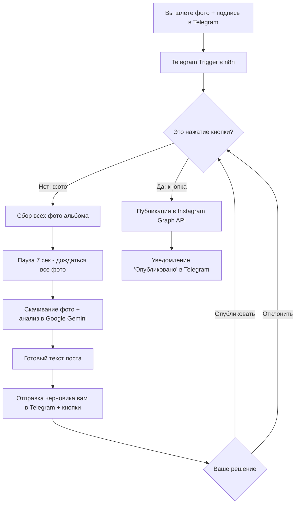

# 📸 Публикация постов в Instagram через Telegram (мебель) на базе n8n

Проект-автоматизация: вы отправляете боту в Telegram фотографии готовой работы
(кухня, шкаф, гардеробная — можно несколько фото сразу), n8n через бесплатный ИИ
**Google Gemini** анализирует снимки, пишет продающий пост с призывом подписаться/заказать,
присылает черновик обратно вам в Telegram. Вы нажимаете **«Опубликовать»** — и пост
автоматически выходит в вашем **Instagram** (одиночное фото или карусель).

---

## 🧭 Как это работает (схема)



---

## 📦 Что внутри репозитория

| Файл | Назначение |
|------|-----------|
| `docker-compose.yml` | Запуск n8n + PostgreSQL (+ опциональный Cloudflare Tunnel) |
| `Dockerfile` | Образ n8n (официальный + таймзона) |
| `.env.example` | Шаблон переменных окружения (токены, пароли) |
| `workflows/instagram-telegram-publisher.json` | Готовый воркфлоу для импорта в n8n |
| `README.md` | Эта инструкция |

---

## 🖥️ Требования и расчёт ресурсов ПК

**Важный принцип экономии:** тяжёлый ИИ-анализ фото выполняется **не на вашем ПК**, а в
облаке Google Gemini (бесплатный тариф). Локально крутится только n8n + база данных —
это очень лёгкая нагрузка.

### Потребление ресурсов

| Компонент | RAM (простой) | RAM (пик) | CPU | Диск |
|-----------|---------------|-----------|-----|------|
| n8n | 250–400 МБ | 600–800 МБ | низкий, кратковременные всплески | ~600 МБ (образ) |
| PostgreSQL | 40–80 МБ | до 250 МБ | очень низкий | ~150 МБ + рост БД |
| Cloudflare Tunnel (опц.) | ~20 МБ | ~30 МБ | минимальный | ~50 МБ |
| **ИТОГО** | **~0.5 ГБ** | **~1.5 ГБ** | **< 1 ядра в среднем** | **~1–2 ГБ** |

### Вывод для вашего сервера (8 ГБ RAM / 4 ядра)

- ✅ Используется примерно **15–20% ОЗУ** (≈1.5 ГБ из 8 ГБ) — огромный запас.
- ✅ CPU в среднем загружен **менее чем на 5%**; всплеск до ~1 ядра происходит на пару
  секунд при кодировании фото в base64 и отправке в Gemini.
- ✅ 10 постов в день — это ничтожная нагрузка; узким местом будут не ресурсы ПК,
  а лимиты бесплатных API (см. ниже), которых с запасом хватает.
- ⛔ **Локальную ИИ-модель зрения (например Ollama + LLaVA) на 8 ГБ ставить не стоит** —
  модель 7B съест 5–6 ГБ RAM и будет считать фото медленно на CPU. Облачный Gemini
  быстрее, бесплатнее по ресурсам и точнее.

В `docker-compose.yml` уже заданы лимиты памяти: n8n — 2 ГБ, PostgreSQL — 512 МБ.

---

## ✅ Что нужно подготовить (аккаунты и ключи)

Перед запуском вам понадобятся **4 набора данных**. Ниже — по шагам.

### 1. Токен Telegram-бота
1. Откройте в Telegram чат с **@BotFather**.
2. Отправьте `/newbot`, задайте имя и username бота.
3. BotFather пришлёт **токен** вида `123456789:AAefg...`. Сохраните его →
   это `TELEGRAM_BOT_TOKEN`.
4. Напишите своему новому боту любое сообщение (`/start`), чтобы он мог вам отвечать.

### 2. Ключ Google Gemini (бесплатный ИИ)
1. Перейдите на **https://aistudio.google.com/apikey** (нужен Google-аккаунт).
2. Нажмите **Create API key** → скопируйте ключ вида `AIza...` → это `GEMINI_API_KEY`.
3. Бесплатный лимит модели `gemini-2.0-flash` с запасом покрывает ~10 постов/день.

### 3. Instagram Graph API (Meta)
> Требуется: Instagram‑аккаунт типа **Business/Professional**, привязанный к
> **Facebook‑странице**. Личный аккаунт Instagram публиковать через API не может.

1. **Переведите Instagram в Business** и привяжите его к Facebook‑странице
   (Instagram → Настройки → Тип аккаунта → «Профессиональный»).
2. Зайдите в **https://developers.facebook.com** → **My Apps** → **Create App** →
   тип **Business**.
3. Добавьте продукт **Instagram** (Instagram Graph API) в приложение.
4. Откройте **Graph API Explorer** (https://developers.facebook.com/tools/explorer):
   - Выберите ваше приложение.
   - Нажмите **Generate Access Token**, дайте разрешения:
     `instagram_basic`, `instagram_content_publish`,
     `pages_show_list`, `pages_read_engagement`, `business_management`.
5. Получите **IG_USER_ID** (ID Instagram‑бизнес‑аккаунта):
   - В Explorer выполните запрос: `me/accounts` → найдите вашу Facebook‑страницу и её `id`.
   - Затем запрос: `{page-id}?fields=instagram_business_account` →
     полученный `id` и есть `IG_USER_ID`.
6. Сделайте **долгоживущий токен** (60 дней) вместо короткого:
   ```
   https://graph.facebook.com/v21.0/oauth/access_token?grant_type=fb_exchange_token&client_id=APP_ID&client_secret=APP_SECRET&fb_exchange_token=КОРОТКИЙ_ТОКЕН
   ```
   Ответ содержит `access_token` → это `IG_ACCESS_TOKEN`.
   > ⏰ Токен живёт ~60 дней. Перед истечением повторите обмен и обновите `.env`.

> ℹ️ Пока приложение в режиме разработки, публиковать можно только на аккаунты,
> добавленные как **роли/тестировщики** приложения — для личного использования этого
> достаточно, режим Live и проверка Meta не требуются.

### 4. Публичный адрес для вашего локального n8n (туннель)
Telegram доставляет сообщения на **webhook**, поэтому локальный n8n должен быть доступен
по HTTPS из интернета. Выберите один вариант.

**Вариант A — ngrok (быстро для теста):**
1. Установите ngrok (https://ngrok.com/download), зарегистрируйтесь, добавьте authtoken.
2. Запустите: `ngrok http 5678`
3. Скопируйте выданный `https://xxxx.ngrok-free.app` → это ваш `WEBHOOK_URL`.
   > Бесплатный ngrok меняет адрес при каждом перезапуске — тогда обновляйте `.env` и
   > переактивируйте воркфлоу.

**Вариант B — Cloudflare Tunnel (стабильный адрес, рекомендуется):**
1. Создайте бесплатный туннель в Cloudflare Zero Trust, получите **tunnel token**.
2. В `docker-compose.yml` раскомментируйте сервис `cloudflared` и задайте
   `CLOUDFLARE_TUNNEL_TOKEN` в `.env`.
3. Настройте в Cloudflare публичный hostname → сервис `http://n8n:5678`.
4. `WEBHOOK_URL` = ваш постоянный домен туннеля.

---

## 🚀 Запуск с нуля (пошагово)

### Шаг 1. Установите Docker Desktop
Windows: скачайте и установите **Docker Desktop**, запустите его (должен работать WSL2).
Проверка в PowerShell:
```powershell
docker --version
docker compose version
```

### Шаг 2. Заполните .env
В папке проекта:
```powershell
Copy-Item .env.example .env
```
Откройте `.env` и впишите все значения из раздела выше:
`TELEGRAM_BOT_TOKEN`, `GEMINI_API_KEY`, `IG_USER_ID`, `IG_ACCESS_TOKEN`,
пароли БД, `N8N_BASIC_AUTH_*`, `N8N_ENCRYPTION_KEY` и `WEBHOOK_URL` (адрес туннеля).

> Сгенерировать `N8N_ENCRYPTION_KEY` в PowerShell:
> ```powershell
> [guid]::NewGuid().ToString('N')
> ```

### Шаг 3. Поднимите туннель
Например, ngrok в отдельном окне PowerShell:
```powershell
ngrok http 5678
```
Скопируйте `https://...` адрес в `WEBHOOK_URL` внутри `.env`.

### Шаг 4. Запустите контейнеры
```powershell
docker compose up -d --build
```
Проверьте статус:
```powershell
docker compose ps
docker compose logs -f n8n
```

### Шаг 5. Войдите в n8n и импортируйте воркфлоу
1. Откройте **http://localhost:5678** и войдите (логин/пароль из `N8N_BASIC_AUTH_*`).
2. Слева **Workflows → «...» (три точки) → Import from File**.
3. Выберите `workflows/instagram-telegram-publisher.json`.

### Шаг 6. Подключите Telegram-креденшел
1. Откройте импортированный воркфлоу → нода **Telegram Trigger**.
2. В поле **Credential** → **Create New** → вставьте `TELEGRAM_BOT_TOKEN` → Save.
   > Токены Gemini и Instagram настраивать в UI **не нужно** — Code-ноды читают их из
   > переменных окружения (`$env`), которые уже переданы контейнеру из `.env`.

### Шаг 7. Активируйте воркфлоу
Переключите тумблер **Active** (вверху справа) в положение «включено».
n8n автоматически зарегистрирует webhook в Telegram на ваш `WEBHOOK_URL`.

### Шаг 8. Тест
1. Отправьте боту 1–5 фотографий готовой мебели (одним альбомом), можно с подписью
   (например: «Кухня из МДФ, фасады крашеные, матовый белый»).
2. Через несколько секунд бот пришлёт **черновик поста** с фото и кнопками.
3. Нажмите **«Опубликовать»** → пост появится в Instagram, бот пришлёт «Опубликовано».

---

## 🧑‍🔧 Как пользоваться каждый день
1. Сделали работу → сфоткали → скинули боту фото (можно несколько — будет карусель).
2. По желанию добавьте короткий комментарий к фото (материал, стиль, город) —
   ИИ учтёт его в тексте.
3. Прочитали черновик → **Опубликовать** или **Отклонить**.
4. Отклонили и хотите иначе — просто отправьте фото заново.

---

## ⚙️ Настройка под себя
- **Стиль текста / призыв / хештеги** — отредактируйте промпт в ноде
  **Generate Post (AI)** (переменная `prompt`).
- **Модель ИИ** — поменяйте `GEMINI_MODEL` в `.env` (например, `gemini-1.5-flash`).
- **Время ожидания альбома** — нода **Wait (debounce)** (по умолчанию 7 сек) и порог
  `6500` мс в ноде **Debounce & Load**. Увеличьте, если фото приходят медленно.

---

## 🩺 Диагностика проблем (Troubleshooting)

| Симптом | Причина / решение |
|---------|-------------------|
| Бот не отвечает | Воркфлоу не активен; неверный `WEBHOOK_URL`; туннель не запущен. Проверьте `docker compose logs -f n8n`. |
| «Webhook … not registered» | Переактивируйте воркфлоу после смены адреса туннеля (выкл/вкл тумблер Active). |
| В посте «Ошибка ИИ» | Неверный `GEMINI_API_KEY` или исчерпан лимит. Проверьте ключ в Google AI Studio. |
| «Ошибка публикации» в Telegram | Смотрите текст ошибки Meta. Частое: истёк `IG_ACCESS_TOKEN`, аккаунт не Business, нет прав `instagram_content_publish`. |
| Instagram не видит картинку | Фото должно быть доступно по публичному HTTPS. Мы отдаём ссылку Telegram — она публична; убедитесь, что бот-токен верный и файл < 8 МБ, формат JPG. |
| Приходит только 1 фото из альбома | Увеличьте паузу в **Wait (debounce)** до 10 сек и порог до `9500`. |
| `$env is not defined` в Code-ноде | Убедитесь, что в compose стоит `N8N_BLOCK_ENV_ACCESS_IN_NODE=false` и контейнер пересоздан (`docker compose up -d --build`). |

---

## 🔐 Безопасность
- `.env` содержит токены и пароли — он в `.gitignore`, **не коммитьте его**.
- Вход в редактор n8n защищён Basic Auth (`N8N_BASIC_AUTH_*`) — задайте надёжный пароль.
- Ссылки на фото Telegram содержат бот‑токен; они используются только для скачивания
  и передачи в Instagram. Не публикуйте эти ссылки.

---

## 🛠️ Полезные команды
```powershell
# Логи n8n
docker compose logs -f n8n

# Перезапуск после правки .env
docker compose up -d --build

# Остановить всё
docker compose down

# Остановить и удалить данные (ОСТОРОЖНО: сотрёт БД и настройки n8n)
docker compose down -v
```

---

## 📌 Ограничения и заметки
- Бесплатные лимиты Meta для публикации: **до 50 постов за 24 часа** на аккаунт — вам
  хватает с большим запасом.
- `IG_ACCESS_TOKEN` живёт ~60 дней — обновляйте его заранее.
- Reels/видео этот воркфлоу не публикует — только фото и карусели фото.
